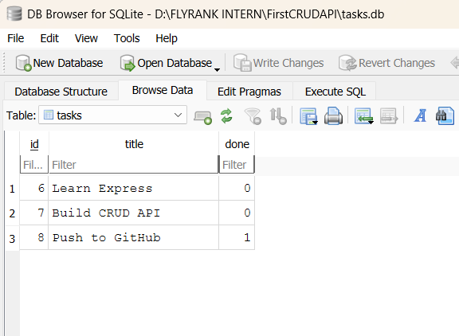
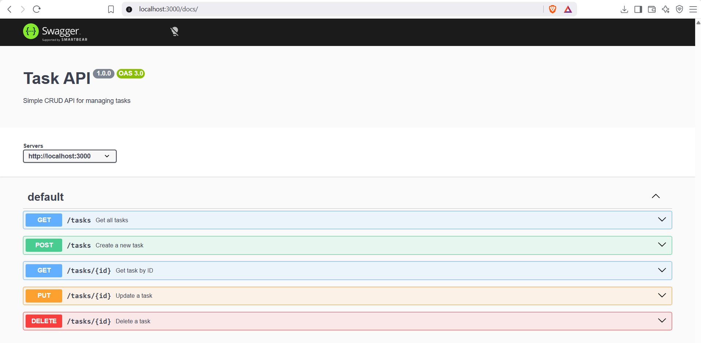

# Task API

A simple CRUD API built with Node.js, Express, and SQLite for managing tasks.

This project was originally built using in-memory storage and has now been upgraded to use a persistent SQLite database.

## Features

- Get all tasks
- Get task by ID
- Create a new task
- Update a task
- Delete a task
- SQLite database persistence
- Automatic database and table creation
- Automatic seeding of 3 example tasks
- Input validation
- Parameterized SQL queries
- Swagger UI documentation

---

## Why SQLite?

SQLite was chosen because it is lightweight, requires zero database server setup, and stores the entire database in a single file.

Unlike the previous in-memory version of this API, tasks stored in SQLite survive server restarts.

The database file is:

```text
tasks.db
```

It is created automatically when the application starts if it does not already exist.

`tasks.db` is included in `.gitignore`, so every fresh clone creates its own database automatically.

---

## Installation

Clone the repository and install the dependencies:

```bash
npm install
```

## Run the Project

```bash
node server.js
```

The server runs at:

```text
http://localhost:3000
```

Swagger UI:

```text
http://localhost:3000/docs
```

No manual database setup is required. On the first run, the application automatically creates `tasks.db`, creates the `tasks` table, and seeds three example tasks.

---

## Database Schema

The SQLite database contains a `tasks` table with the following columns:

| Column | Type | Description |
|--------|------|-------------|
| id | INTEGER | Primary key, automatically generated |
| title | TEXT | Task title |
| done | INTEGER | Completion status stored as 0 or 1 |

---

## API Endpoints

| Method | Endpoint | Description |
|--------|----------|-------------|
| GET | / | API Info |
| GET | /health | Health Check |
| GET | /tasks | Get All Tasks |
| GET | /tasks/:id | Get Task by ID |
| POST | /tasks | Create Task |
| PUT | /tasks/:id | Update Task |
| DELETE | /tasks/:id | Delete Task |

### Status Codes

- `200 OK` - Successful GET or PUT
- `201 Created` - Task successfully created
- `204 No Content` - Task successfully deleted
- `400 Bad Request` - Invalid request body
- `404 Not Found` - Task or route not found

---

## Example Request

Create a new task:

```bash
curl -i -X POST http://localhost:3000/tasks \
-H "Content-Type: application/json" \
-d "{\"title\":\"Buy Milk\"}"
```

Example response:

```json
{
  "id": 4,
  "title": "Buy Milk",
  "done": false
}
```

---

## SQLite and Persistence

All CRUD operations now use SQL queries instead of an in-memory JavaScript array.

For example, tasks are read using:

```sql
SELECT * FROM tasks;
```

Individual tasks use parameterized queries such as:

```sql
SELECT * FROM tasks WHERE id = ?;
```

Using parameterized placeholders keeps user input separate from the SQL query and helps protect the database from SQL injection.

Tasks remain stored in `tasks.db` even after the Node.js server is stopped and restarted.

---

## SQL Exploration

The database was also explored directly using DB Browser for SQLite.

Example query:

```sql
SELECT COUNT(*) FROM tasks;
```

This query returns the total number of tasks stored in the database.

Other SQL queries tested include:

```sql
SELECT * FROM tasks;

SELECT * FROM tasks WHERE done = 1;

UPDATE tasks SET done = 1;

DELETE FROM tasks WHERE done = 1;
```

Changes made directly in DB Browser were immediately reflected by the API because both the API and DB Browser use the same SQLite database file.

---

## Database Screenshot

The `tasks` table viewed using DB Browser for SQLite:



---

## Swagger UI

Interactive API documentation is available at:

```text
http://localhost:3000/docs
```



---

## Technologies Used

- Node.js
- Express.js
- SQLite
- better-sqlite3
- Swagger UI Express
- OpenAPI 3.0
- DB Browser for SQLite

---

## Storage Migration

The API endpoints and their behavior remain the same as the original in-memory CRUD API. Only the storage layer was changed from a JavaScript array to SQLite.

The same API requests continue to work after the migration, demonstrating that the database is an implementation detail behind the API.